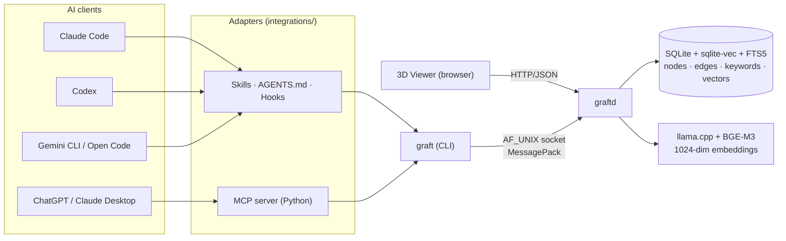

<div align="center">

# graft

**Persistent graph memory for AI agents.**
Save what you learned. Retrieve it across sessions, machines, and agents. Local-first, no SaaS, no API key.

<sub>C11 · SQLite + sqlite-vec + FTS5 · llama.cpp + BGE-M3 · MessagePack · AF_UNIX socket</sub>

[](./LICENSE)
[](#status)
[](#install)

</div>

---

graft is a daemon plus a CLI. The daemon owns a small SQLite database that stores every "thing you learned" as a node with a 1024-dim embedding, lexical signals, and graph edges to related nodes. The CLI is the agent-facing surface: a few subcommands (`insert`, `query`, `retrieve`, `explore`, …) that any agent can call as a tool.

The result: an LLM session that ends doesn't take its hard-won lessons with it. The next session — or another agent on the same box — can find them in milliseconds.

## Table of contents

- [What you get](#what-you-get)
- [See it in action](#see-it-in-action)
- [Why graft](#why-graft)
- [Install](#install)
- [Use it](#use-it)
- [Plug it into your agent](#plug-it-into-your-agent)
- [HTTP API + 3D viewer](#http-api--3d-viewer)
- [Architecture](#architecture)
- [Configuration](#configuration)
- [Status](#status)
- [Roadmap](#roadmap)
- [Contributing](#contributing)
- [License](#license)

## What you get

- **Cache-first retrieval** — `graft query <text>` returns `STRONG` / `WEAK` / `MISS` in milliseconds. STRONG hits inject title + body (and the body is rendered as Markdown) directly into the agent's context.
- **Hybrid search** — `graft retrieve` fuses dense (BGE-M3 cosine) and lexical (BM25 over title and body) via Reciprocal Rank Fusion.
- **Graph walks** — `graft explore` follows keyword and semantic edges with beam search and MMR diversity, decay `gamma^step`.
- **Multi-tenant profiles** — isolated DBs and sockets per profile (`work`, `personal`, project-scoped). Import/export as files.
- **Local-first** — single binary, single DB file, no network. Models run on CPU out of the box; opt-in to CUDA or ROCm 6/7 with a flag.
- **Pluggable into anything** — Claude Code (skills + hooks), Codex (AGENTS.md + hooks), ChatGPT / Claude Desktop (MCP server), Gemini CLI, Open Code.
- **Optional HTTP / REST + 3D viewer** — flip a flag in `config.yaml`, get six JSON endpoints and a browser-based graph explorer with click-to-edit (atomic supersession), search/retrieve/explore overlays, and ranked-result navigation.

## See it in action

```console
$ graft query "spring boot validation cascade nested DTO"
{ "status": 0, "result": { "hit": "MISS" } }

# ... you debug the issue, find the answer ...

$ graft insert \
    --title "Spring Boot @Valid cascade on nested DTOs needs @Valid on the field plus @Validated on the controller" \
    --body  "Without @Valid on the nested field, constraints inside it are silently ignored. Tested on Spring Boot 3.2; matches the Jakarta Validation spec." \
    --keyword spring-boot --keyword validation --keyword gotcha
{ "status": 0, "result": { "id_hex": "019e09a95e7a...", "duplicate": false } }

# ... weeks later, on another machine, in another agent ...

$ graft query "why is my @Valid annotation not cascading on a nested DTO field"
{
  "status": 0,
  "result": {
    "hit": "STRONG",
    "title": "Spring Boot @Valid cascade on nested DTOs needs @Valid on the field plus @Validated on the controller",
    "body":  "Without @Valid on the nested field, constraints inside it are silently ignored. ..."
  }
}
```

The two queries used different phrasing. The match is semantic plus lexical, gated by a verify step that refuses to claim a hit when the signals are weak.

## Why graft

Plenty of agent-memory projects exist (mem0, Letta, Zep, Cognee, Graphiti, …). They are libraries you import into a Python app or services you self-host with a database. graft picks a different shape:

- **A binary, not a library.** The CLI is the contract. Any agent that can run a subprocess can use it — no Python runtime, no SDK to import, no version drift between client and server.
- **Daemon + AF_UNIX socket.** State lives in one process; the CLI is a thin client. Cold start ~1–2 s the first time; subsequent calls under 100 ms warm.
- **Multi-agent by design.** Claude Code, Codex, ChatGPT, and Claude Desktop already share the same graph on this machine — different surfaces, one memory. The `integrations/` directory ships the adapters.
- **Local-first, no managed service.** SQLite on disk, llama.cpp for embeddings, no telemetry. Backups are `cp graft.db dest/`.
- **Cache-first, then retrieve.** Most reads are answered by a verified top-1 cache lookup, not a top-k semantic spray. Lower latency, less context noise, fewer hallucinations.

It is not a vector database, a RAG framework, or a chatbot platform. It is the smallest useful thing that makes an agent's hard-won knowledge survive its session.

## Install

### Homebrew (macOS / Linux)

```bash
brew tap AEndrix03/graft https://github.com/AEndrix03/Graft.git
brew install graft
graft stats
```

The formula builds `graft` and `graftd` from source, installs the pinned BGE-M3
model resource, and keeps user profiles under `~/.graft`. For unreleased
development builds use `brew install --HEAD graft` or `brew reinstall --HEAD graft`.
See [docs/Homebrew.md](./docs/Homebrew.md) for tap maintenance and release checks.

### One-shot

```bash
git clone https://github.com/AEndrix03/graft.git && cd graft
bash scripts/install.sh        # Linux, macOS, Windows MSYS2
pwsh scripts/install.ps1       # Windows (auto-installs MSYS2 if needed)
```

The installer is idempotent. It checks system packages, initialises submodules, builds llama.cpp, downloads BGE-M3 (~600 MB, Q8_0 GGUF), builds `graft` + `graftd`, runs a smoke test, and activates the commit-msg policy hook for contributors.

### GPU acceleration (optional)

CPU is the default. To build llama.cpp with GPU support pass `GRAFT_GPU` to the installer:

```bash
GRAFT_GPU=cuda  bash scripts/install.sh           # NVIDIA CUDA
GRAFT_GPU=hip   bash scripts/install.sh           # AMD ROCm 6 or 7
pwsh scripts/install.ps1 -Gpu cuda                   # PowerShell equivalent
```

Then enable offload in `config.yaml`:

```yaml
embedding:
  hardware_accel: true
```

The daemon refuses to start with `hardware_accel: true` on a CPU-only build (no silent CPU fallback).

### Manual

If you prefer to drive each step yourself:

```bash
# 1. Submodules
git submodule update --init --recursive

# 2. llama.cpp (CPU; add -DGGML_CUDA=ON or -DGGML_HIP=ON for GPU)
cd third_party/llama.cpp
cmake -B build -DBUILD_SHARED_LIBS=ON -DGGML_NATIVE=ON \
               -DLLAMA_CURL=OFF -DLLAMA_BUILD_SERVER=OFF \
               -DLLAMA_BUILD_TOOLS=OFF -DLLAMA_BUILD_EXAMPLES=OFF \
               -DLLAMA_BUILD_TESTS=OFF -DLLAMA_BUILD_COMMON=OFF \
               -DCMAKE_BUILD_TYPE=Release
cmake --build build -j
cd ../..

# 3. BGE-M3 (~600 MB, Q8_0 GGUF)
mkdir -p models
curl -L --ssl-no-revoke -o models/bge-m3.gguf \
  https://huggingface.co/lm-kit/bge-m3-gguf/resolve/main/bge-m3-Q8_0.gguf

# 4. graft
cmake -B build && cmake --build build
```

Output: `build/graft` (CLI) and `build/graftd` (daemon).

## Use it

The CLI auto-starts the daemon on the first call. You don't need to manage process lifecycle.

### Save knowledge

```bash
graft insert \
  --title "Short, retrieval-shaped statement of what you learned" \
  --body  "Longer prose: the why, the trap, a code snippet, references" \
  --keyword <kw1> --keyword <kw2> --keyword <kw3>
```

Idempotent: re-inserting the same `title + body + keywords` returns `duplicate: true`.

### Search

```bash
# Verified cache lookup
graft query "the question or topic"

# Hybrid top-k (lexical + semantic, fused via RRF)
graft retrieve "topic" --top-k 10

# Graph walk from a seed, filtered by keyword
graft explore "topic" --keyword <kw> --depth 3 --beam 4

# Suggest keywords for a draft title (uses existing graph keywords)
graft classify --title "your draft"
```

### Inspect

```bash
graft get <id_hex>             # fetch one node (JSON)
graft get <id_hex> --markdown  # human-readable Markdown rendering
graft stats                    # similarity-distribution percentiles
graft analytics --since 7d     # hit rate, latency, time-saved estimate
```

The `--markdown` flag prints the node as YAML-frontmatter Markdown — title, author, date, optional expiration, hashtag-style keywords, and the body. Optional rows are skipped when missing. Designed for human consumption; agents continue to use the JSON form.

### Profiles

Each profile is a tenant: its own DB, its own daemon, its own socket. The `default` profile is created at first run.

```bash
graft profile list
graft profile add work
graft profile add personal

# Switch profile for the current shell:
eval "$(graft profile set work)"      # bash / zsh / fish
graft profile set work | iex          # PowerShell

# Backup / move a profile:
graft profile export work --path work-2026-05.graftprofile
graft profile import --name work-restored --file work-2026-05.graftprofile

# Bind a profile to a remote SQLite profile file and sync manually:
graft profile remote bind work --url /path/to/remote.graft.db
graft profile remote status work
graft profile remote sync work
graft profile remote detach work
```

There is no global state file — `set` prints an env var, you decide whether to apply it for the session or persist it in your shell rc.

## Plug it into your agent

Adapters live under `integrations/`. Each one has its own README with install steps.

| Agent          | Integration type             | Where it lives                                       |
| -------------- | ---------------------------- | ---------------------------------------------------- |
| Claude Code    | Skills + Hooks               | `integrations/claude-code/`                          |
| Codex          | `AGENTS.md` + Hooks          | `integrations/codex/`                                |
| Claude Desktop | MCP server                   | `integrations/claude-ai/` + `integrations/mcp-server/` |
| ChatGPT        | MCP server                   | `integrations/chatgpt/` + `integrations/mcp-server/` |
| Gemini CLI     | `GEMINI.md`                  | `integrations/gemini-cli/`                           |
| Open Code      | `AGENTS.md`                  | `integrations/opencode/`                             |

Two complementary layers across most clients:

- **Skills / `AGENTS.md`** instruct the model on _when_ to use graft (search before answering non-trivial questions, save after solving non-obvious ones, skip for trivial work).
- **Hooks** (Claude Code, Codex) are run by the harness deterministically: `UserPromptSubmit` injects the cache result before the model responds; `PostToolUse` records edits as save-candidates; `Stop` proposes `/memoryze` at end of turn. The model can no longer "forget" to consult the graph — that's the harness's job now.

## HTTP API + 3D viewer

graft ships an optional REST layer alongside the unix socket. **Off by default**; enable in `config.yaml`:

```yaml
http:
  enabled: true
  bind: "127.0.0.1"
  port: 9977
```

Then either `curl` directly or open the browser viewer:

```bash
graft view              # opens http://127.0.0.1:9977/ in your default browser
```

You get:

- **Six JSON endpoints** under `/v1/*` — `match`, `search`, `explore`, `classify`, `insert`, `nodes/{id}` (GET + DELETE), plus `view` for the full graph dump and `healthz` for liveness probes.
- **A 3D graph viewer** (Vue 3 + three.js + CodeMirror) served as a static SPA from the same daemon. Color-coded edges (semantic / keyword / supersedes), per-node coloring by primary keyword hash, content-proportional sphere size, search/retrieve/explore overlays with red→orange ranked result colors, click-to-edit with atomic supersession on save.
- **Local-first defaults** — bind is `127.0.0.1`, `delete` is off by default. No telemetry, no CDN dependencies in the SPA.
- **Per-endpoint enable flags** — `endpoint_match: true`, `endpoint_delete: false`, etc. Disable what you don't want exposed.

The daemon has no OAuth/JWT logic and should remain bound to `127.0.0.1`.
For production, run the Python gateway in `integrations/mcp-server/`:

```bash
cd integrations/mcp-server
export GRAFT_OAUTH_ISSUER_URL="https://issuer.example.com"
export GRAFT_OAUTH_RESOURCE_SERVER_URL="https://graft.example.com/mcp"
export GRAFT_OAUTH_AUDIENCE="https://graft.example.com"
uvicorn oauth_gateway:app --host 127.0.0.1 --port 8080
```

The gateway mounts MCP streamable HTTP at `/mcp` and proxies authenticated
`/v1/*` calls to `GRAFT_UPSTREAM_HTTP` (default `http://127.0.0.1:9977`).
It validates externally issued OIDC access tokens as an OAuth resource server.
Use HTTPS in front of the gateway for any public deployment.

Full reference: [`docs/HTTP-API.md`](./docs/HTTP-API.md). Viewer specifics: [`viewer/README.md`](./viewer/README.md).

```bash
# Build the viewer once after install (or after pulling viewer changes)
cd viewer && npm install && npm run build
```

## Architecture



Pipelines:

- **insert** — `embed(title)` → upsert keywords → `vector_topk` per keyword for keyword-edges → `vector_topk + MMR` for semantic edges → atomic INSERT.
- **query** — `embed(text)` → `vector_topk(1)` → trigram Jaccard verify (cross-encoder optional) → STRONG / WEAK / MISS gating.
- **retrieve** — three lists (vec, BM25 title, BM25 body) → RRF fusion → top-k.
- **explore** — seed via `vector_topk` filtered by keyword → beam search with MMR + decay `gamma^step`.

For per-module reference open the headers in `include/graft/` (`storage.h`, `embed.h`, `verify.h`, `ops.h`).

## Configuration

`config.example.yaml` ships the defaults. Copy to `config.yaml` to customise. The keys you'll touch most:

| Key                                  | Default | What it does                                                                |
| ------------------------------------ | ------- | --------------------------------------------------------------------------- |
| `embedding.threads`                  | `4`     | llama.cpp thread count                                                      |
| `embedding.hardware_accel`           | `false` | Offload all model layers to GPU (requires GPU build)                        |
| `cache.weak_hit_min_vec`             | `0.85`  | Cosine floor for a WEAK hit                                                 |
| `cache.strong_hit_min_lex`           | `0.15`  | Trigram Jaccard floor for a STRONG hit                                      |
| `retrieval.top_k`                    | `25`    | Top-k for `graft retrieve`                                               |
| `retrieval.query_fallback_top_k`     | `5`     | Cap on neighbours surfaced when `graft query` MISSes                     |
| `edges.edge_semantic_min`            | `0.6`   | Cosine floor for a semantic edge between nodes                              |

## Status

graft is **alpha**. It works end-to-end on Linux, macOS, and Windows MSYS2; the CLI surface is stable enough that the integrations rely on it. Things to know:

- The cross-encoder reranker is a stub (`mg_ce_score_pair` returns `-1`). The "rerank" today is the trigram-Jaccard plus cosine multi-signal gating in `src/verify/verify.c`. The hook for a real reranker (BGE-reranker-v2-m3) is in place; wiring it is on the roadmap.
- Tests cover the storage, retrieval, insert and config paths, but coverage is uneven.
- No prebuilt binaries yet — build from source with `scripts/install.sh`.
- API contract: the CLI JSON schema is the public surface. Internal C APIs may change without notice.

## Roadmap

- Cross-encoder neural reranker (BGE-reranker-v2-m3) wired through `verification.cross_encoder_enabled`.
- NLI for contradiction detection → `MG_EDGE_CONTRADICTS` edges.
- Adaptive threshold calibration driven by `stats`.
- Real `consolidate` (dedup, supersede, stale-mark).
- Importable thematic memory packs (postmortems, decision frameworks, etc.) as opt-in seed libraries.

## Contributing

See [CONTRIBUTING.md](./CONTRIBUTING.md). Short version: branch from `master`, run `bash scripts/install.sh` once (it activates the commit-msg policy hook), keep PRs focused. Bug reports and feature ideas: [GitHub Issues](https://github.com/AEndrix03/graft/issues).

## License

[Apache License 2.0](./LICENSE). You can use, modify, distribute, and embed graft in proprietary projects, including commercially, provided you keep the copyright and licence notices and document any changes you make to the source files.
