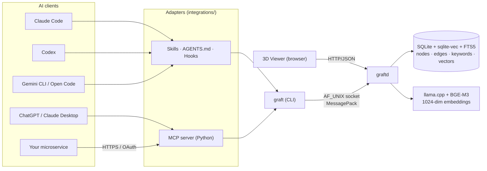

<div align="center">


<h1>graft</h1>

<p><strong>Persistent graph memory for AI agents and microservices.</strong><br/>
Save what you learned. Retrieve it across sessions, machines, agents, and services — in milliseconds.<br/>
Local-first. No SaaS. No API key. One binary. One SQLite file.</p>

<sub>C11 · SQLite + sqlite-vec + FTS5 · llama.cpp + BGE-M3 · MessagePack · AF_UNIX socket · optional REST + 3D viewer</sub>

<br/><br/>

[](./LICENSE)
[](#project-status)
[](./docs/install/)
[](./docs/install/)
[](./docs/profiles/)
[](./docs/)

<br/>

<sub>Made for Claude Code · Codex · ChatGPT · Claude Desktop · Gemini CLI · Open Code · and your own microservices.</sub>

</div>

---

## Why graft exists

Every AI agent has the same problem: it forgets. The session ends, the context window scrolls, the next conversation starts from zero. Hard-won lessons evaporate.

`graft` is the smallest useful thing that fixes that.

- **One binary.** No Python runtime to align, no SDK to import, no cloud account to create.
- **One SQLite file.** Backups are `cp`. Sharing a profile is `cp`. Migrating to a new machine is `cp`.
- **Verified semantic cache.** Most reads are answered by a verified **top-1** lookup in milliseconds — not a top-k semantic spray that floods your agent's context.
- **A graph, not a list.** Memories link to each other via keyword and semantic edges, so "what do I know about X?" walks the connected sub-graph, not the whole corpus.
- **Multi-tenant by profile.** `work`, `personal`, `project-a`, `project-b` are isolated DBs and isolated daemons. Switching is one env var.

If you're tired of "I asked Claude to remember the constraint and it forgot in three turns" — graft is the answer.

---

## Install in 30 seconds

```bash
brew tap AEndrix03/graft https://github.com/AEndrix03/Graft.git
brew install graft
graft stats
```

That's it. No daemon to start. No model to download by hand. No config to write.

> Not on macOS / Linux Homebrew? Run the cross-platform installer:
>
> ```bash
> git clone https://github.com/AEndrix03/graft.git && cd graft
> bash scripts/install.sh         # Linux, macOS, Windows MSYS2
> pwsh scripts/install.ps1        # Windows (auto-installs MSYS2 if needed)
> ```
>
> Optional GPU acceleration: `GRAFT_GPU=cuda bash scripts/install.sh` (NVIDIA CUDA) or `GRAFT_GPU=hip bash scripts/install.sh` (AMD ROCm 6 / 7). The build is **fast** — under 3 minutes on a laptop — so contributors can iterate without pain.

Full installation reference: [`docs/install/`](./docs/install/).

---

## See it in action — 60 seconds

```console
$ graft query "spring boot validation cascade nested DTO"
{ "status": 0, "result": { "hit": "MISS" } }

# ... you debug the issue, find the answer ...

$ graft insert \
    --title "Spring Boot @Valid cascade on nested DTOs needs @Valid on the field plus @Validated on the controller" \
    --body  "Without @Valid on the nested field, constraints inside it are silently ignored. Tested on Spring Boot 3.2; matches the Jakarta Validation spec." \
    --keyword spring-boot --keyword validation --keyword gotcha
{ "status": 0, "result": { "id_hex": "019e09a95e7a...", "duplicate": false } }

# ... weeks later, on another machine, in another agent ...

$ graft query "why is my @Valid annotation not cascading on a nested DTO field"
{
  "status": 0,
  "result": {
    "hit":   "STRONG",
    "title": "Spring Boot @Valid cascade on nested DTOs needs @Valid on the field plus @Validated on the controller",
    "body":  "Without @Valid on the nested field, constraints inside it are silently ignored. ..."
  }
}
```

The two queries used **different phrasing**. The match is semantic plus lexical, gated by a verify step that **refuses to claim a hit when the signals are weak** — so your agent never quotes confidently-wrong answers.

---

## What you get

<table>
<tr>
<td width="33%" valign="top">

#### Cache-first retrieval
`graft query <text>` returns `STRONG` / `WEAK` / `MISS` in milliseconds.
STRONG injects title + body straight into the agent's context.

</td>
<td width="33%" valign="top">

#### Hybrid search
`graft retrieve` fuses dense (BGE-M3 cosine) and lexical (BM25 over title and body) via Reciprocal Rank Fusion.

</td>
<td width="33%" valign="top">

#### Graph walks
`graft explore` follows keyword and semantic edges with beam search and MMR diversity, decay `gamma^step`.

</td>
</tr>
<tr>
<td valign="top">

#### Multi-tenant profiles
Isolated DBs and sockets per profile (`work`, `personal`, project-scoped).
Import / export / merge as plain SQLite files.

</td>
<td valign="top">

#### Local-first
Single binary, single DB file, no network.
Models run on CPU out of the box; opt-in to CUDA or ROCm 6 / 7 with a flag.

</td>
<td valign="top">

#### Optional REST + 3D viewer
Flip a flag in `config.yaml`, get nine JSON endpoints and a browser-based graph explorer with click-to-edit (atomic supersession).

</td>
</tr>
<tr>
<td valign="top">

#### Pluggable into anything
Claude Code (skills + hooks), Codex (`AGENTS.md` + hooks), Claude Desktop / ChatGPT (MCP), Gemini CLI, Open Code.

</td>
<td valign="top">

#### Microservices-friendly
Behind your REST gateway: <b>L1 Redis</b> + <b>L2 graft semantic cache</b> + <b>L3 graft + AI agentic retrieve</b>.
[See the pattern](./docs/microservices/).

</td>
<td valign="top">

#### Easy to contribute
Small C11 codebase (~10 K LOC of project code). Builds in under 3 min. Tests + commit-msg policy included.

</td>
</tr>
</table>

---

## The recommended microservice stack

Most "GPT in a microservice" deployments burn money on tokens because every request runs an LLM, even when the answer hasn't changed. Graft fits naturally as the layer that **kills most of those LLM calls before they happen**:

```text
                       ┌──────────────────────────────┐
        ┌────────────► │  L1 — Redis                  │  ~1 ms  · exact key match
        │              │  cache:<sha256(prompt)>      │
        │              └──────────────┬───────────────┘
        │                  MISS       │
        │                             ▼
  Client                 ┌──────────────────────────────┐
   request ─────────────►│  L2 — graft semantic cache   │  ~30–80 ms · paraphrase-aware,
        ▲                │  GET /v1/match?text=...      │              verified STRONG/WEAK/MISS
        │                └──────────────┬───────────────┘
        │                    MISS       │
        │                               ▼
        │                 ┌──────────────────────────────┐
        │                 │  L3 — graft + AI agentic     │  ~500 ms+ · top-k retrieve +
        │                 │  GET /v1/search → LLM        │             LLM synthesis
        │                 │  POST /v1/insert (writeback) │             writeback for next time
        └─────────────────└──────────────────────────────┘
```

| Layer | Latency | Cost | What it answers |
| ----- | ------- | ---- | --------------- |
| **L1** Redis              | ~1 ms        | RAM bytes    | "Have we seen *this exact prompt* before?" |
| **L2** graft semantic     | ~30–80 ms    | CPU (~free)  | "Have we seen *a question that means this* before?" |
| **L3** graft + AI agent   | ~500 ms–N s  | LLM tokens   | "We haven't. Let me reason from related memories." |

Every L3 answer is written back through `POST /v1/insert`, so the next caller hits L2 STRONG instead. **The system gets cheaper and faster over time, with zero ops effort.**

Full pattern, sample code, deployment shapes, and failure modes: **[`docs/microservices/`](./docs/microservices/)**.

---

## Built for AI development tools

```text
┌─────────────────────────────┐    ┌─────────────────────────────┐
│ LLM chat clients            │    │ Coding agents (CLI-based)   │
│ Claude Desktop · ChatGPT    │    │ Claude Code · Codex · ...   │
└──────────────┬──────────────┘    └──────────────┬──────────────┘
               │ MCP (stdio or HTTPS)             │ subprocess
               ▼                                  ▼
┌─────────────────────────────┐    ┌─────────────────────────────┐
│ integrations/mcp-server/    │    │ graft CLI                   │
│  · server.py  (stdio)       │───▶│  → unix socket              │
│  · oauth_gateway.py (HTTP)  │    │                             │
└─────────────────────────────┘    └──────────────┬──────────────┘
                                                  ▼
                                     ┌─────────────────────────────┐
                                     │ graftd (daemon)             │
                                     │  SQLite + sqlite-vec + FTS5 │
                                     │  + BGE-M3 (llama.cpp)       │
                                     └─────────────────────────────┘
```

| Agent          | Integration               | Setup |
| -------------- | ------------------------- | ----- |
| Claude Code    | Skills + Hooks            | `graft setup claudecode` |
| Codex          | `AGENTS.md` + Hooks       | `graft setup codex` |
| Claude Desktop | MCP server (stdio)        | `integrations/claude-ai/claude_desktop_config.json` |
| ChatGPT        | MCP server (stdio or HTTP)| `integrations/chatgpt/mcp_config.json` |
| Gemini CLI     | `GEMINI.md` memory file   | `integrations/gemini-cli/` |
| Open Code      | `AGENTS.md` + Skills      | `graft setup opencode` |

Each adapter ships **skills** (telling the model *when* to search and *when* to save) and, where the harness supports them, **hooks** (running deterministically on `UserPromptSubmit` / `PostToolUse` / `Stop` so the model can't "forget").

Full integration matrix and setup: **[`docs/integrations/`](./docs/integrations/)**.

---

## Try it now — a real round-trip

```bash
graft insert \
  --title "First memory" \
  --body  "If this is retrievable below, graft is wired correctly." \
  --keyword smoke-test

graft query "the very first thing I saved"
# → "hit": "STRONG" + the body you just inserted
```

If you see `"hit": "STRONG"`, your pipeline is healthy: BGE-M3 embedding ↔ `sqlite-vec` vector index ↔ FTS5 lexical ↔ multi-signal verifier are all talking to each other.

---

## Documentation

Everything is broken down by feature. Each page ends with a **"What's missing and how to improve it"** section — pick one and open a PR.

| Folder | What's inside |
| ------ | ------------- |
| [`install/`](./docs/install/)               | Homebrew, install scripts, manual build, GPU builds, first-run check. |
| [`release/`](./docs/release/)               | Versioning, GitHub Releases, signed assets, SBOM, `graft upgrade`. |
| [`architecture/`](./docs/architecture/)     | CLI ↔ daemon split, wire protocol, request lifecycle. |
| [`cli/`](./docs/cli/)                       | Every `graft` / `graftd` subcommand and flag. |
| [`storage/`](./docs/storage/)               | SQLite schema, sqlite-vec, FTS5, atomic supersession, idempotency, WAL. |
| [`embeddings/`](./docs/embeddings/)         | BGE-M3 (1024-dim), llama.cpp, CPU vs CUDA vs ROCm. |
| [`retrieval/`](./docs/retrieval/)           | `query` (cache), `retrieve` (RRF), `explore` (beam + MMR), the verify pipeline. |
| [`insert/`](./docs/insert/)                 | Insert pipeline, keyword / semantic edges, MMR diversity, content hashing, `classify`. |
| [`profiles/`](./docs/profiles/)             | Multi-tenancy, per-profile DB + socket + daemon, export / import / merge / remote sync. |
| [`http-api/`](./docs/http-api/)             | Optional REST layer (`/v1/*`), per-endpoint flags, examples. |
| [`viewer/`](./docs/viewer/)                 | Browser 3D viewer (Vue + three.js + CodeMirror), modes, edit-with-supersession. |
| [`integrations/`](./docs/integrations/)     | Per-agent adapters + MCP gateway. |
| [`microservices/`](./docs/microservices/)   | The L1 Redis + L2 graft + L3 graft + AI stack. |
| [`maintenance/`](./docs/maintenance/)       | `stats`, `consolidate`, usage log, `analytics`. |
| [`configuration/`](./docs/configuration/)   | Every key in `config.yaml`, every recognised environment variable. |

The full index lives at **[`docs/`](./docs/)**.

---

## Why graft, not _other-thing_?

Plenty of agent-memory projects exist (mem0, Letta, Zep, Cognee, Graphiti, ...). They're libraries you import into a Python app, or services you self-host with a database. Graft picks a different shape:

- **A binary, not a library.** The CLI is the contract. Any agent that can run a subprocess can use it — no Python runtime, no SDK version drift between client and server.
- **Daemon + AF_UNIX socket.** State lives in one process; the CLI is a thin client. Cold start ~1–2 s the first time; subsequent calls under 100 ms warm.
- **Multi-agent by design.** Claude Code, Codex, ChatGPT, and Claude Desktop already share the same graph on this machine — different surfaces, one memory.
- **Local-first, no managed service.** SQLite on disk, llama.cpp for embeddings, no telemetry, no account. Backups are `cp graft.db dest/`.
- **Cache-first, then retrieve.** Most reads are answered by a verified top-1 cache lookup, not a top-k semantic spray. Lower latency, less context noise, fewer hallucinations.

Graft is **not** a vector database, a RAG framework, or a chatbot platform. It is the smallest useful thing that makes an agent's hard-won knowledge survive its session.

---

## Architecture in one diagram



Pipelines:

- **insert** — `embed(title)` → upsert keywords → `vector_topk` per keyword (KEYWORD edges) → `vector_topk + MMR` (SEMANTIC edges) → **one atomic SQLite transaction**.
- **query** — `embed(text)` → `vector_topk(10)` → trigram-Jaccard + cosine (+ optional cross-encoder) verify → STRONG / WEAK / MISS gating.
- **retrieve** — three lists (vec, BM25 title, BM25 body) → RRF fusion → top-k.
- **explore** — seed via `vector_topk` filtered by keyword → beam search with MMR + decay `gamma^step`.

Full architecture: [`docs/architecture/`](./docs/architecture/).

---

## Project status

Graft is **alpha**. It works end-to-end on Linux, macOS, and Windows MSYS2 / native. The CLI surface is stable enough that the shipped integrations rely on it. Honest disclosures:

- The **cross-encoder reranker** is a stub (`mg_ce_score_pair` returns `-1`). Today the verify gate uses trigram-Jaccard + cosine, which is plenty for most corpora. Wiring BGE-reranker-v2-m3 is on the roadmap.
- **Tests** cover storage, retrieval, insert, verify, and config paths, but coverage is uneven.
- **Prebuilt releases are being introduced** — source builds remain the fallback until the first signed GitHub Release is published.
- **API contract**: the CLI JSON schema is the public surface. Internal C APIs may change without notice.

### Roadmap (the next-impact list)

- Cross-encoder neural reranker (BGE-reranker-v2-m3) wired through `verification.cross_encoder_enabled`.
- NLI for contradiction detection → `MG_EDGE_CONTRADICTS` edges.
- Adaptive threshold calibration driven by `stats`.
- Real content `consolidate` (dedup similar nodes, supersede stale ones, mark unused).
- Importable thematic memory packs (postmortems, decision frameworks, ...) as opt-in seed libraries.
- Publish the first signed GitHub Release with SBOM, checksums, provenance, and platform archives.

---

## Contributing

```bash
# 1. clone, install, smoke-test
git clone https://github.com/AEndrix03/graft.git && cd graft
bash scripts/install.sh
graft stats

# 2. find something to do
#    every docs page ends with "What's missing and how to improve it"

# 3. branch from master, keep PRs focused
```

Builds are **fast** (under 3 minutes from clean). Tests run with `cmake --build build --target test`. Pre-commit hook for Conventional Commits is installed automatically by `scripts/install.sh`.

Bug reports and feature ideas: [GitHub Issues](https://github.com/AEndrix03/graft/issues). Read [CONTRIBUTING.md](./CONTRIBUTING.md) for the short version.

---

## License

[Apache License 2.0](./LICENSE). You can use, modify, distribute, and embed graft in proprietary projects, including commercially, provided you keep the copyright and licence notices and document any changes you make to the source files.

<div align="center">

<br/>
<sub>Built in C11. Local-first. No SaaS. No API key.<br/>
<a href="./docs/">docs</a> · <a href="./docs/install/">install</a> · <a href="./docs/microservices/">microservices pattern</a> · <a href="https://github.com/AEndrix03/graft/issues">issues</a></sub>
<br/><br/>

</div>
