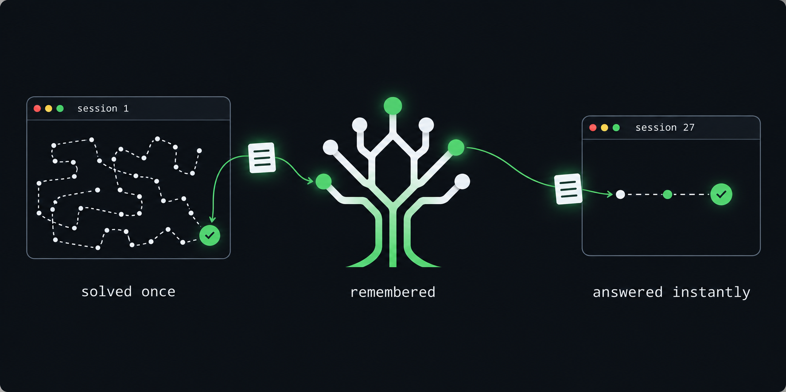
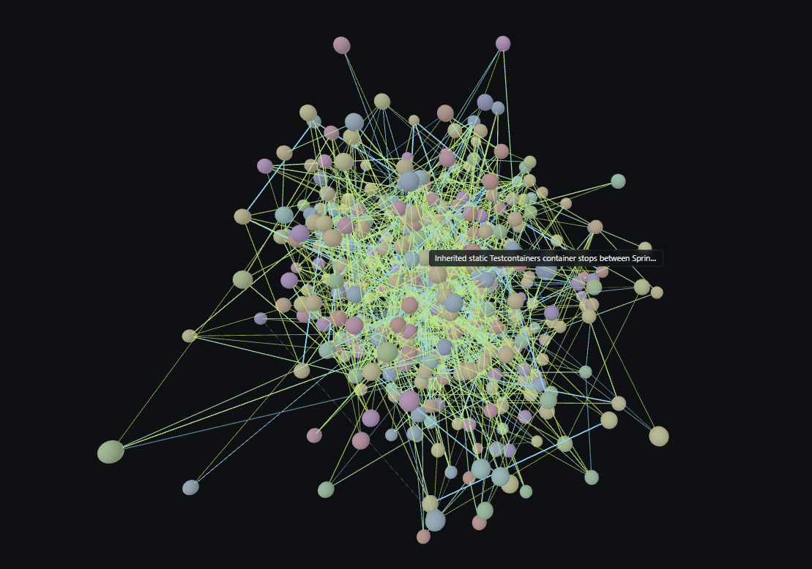
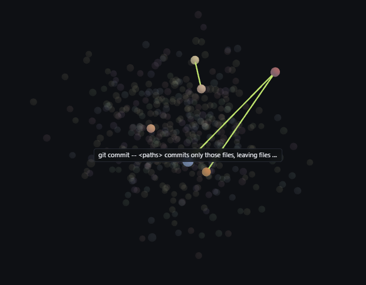

<div align="center">


# graft

### Your coding agent already solved this. Graft makes sure it remembers.

[](https://github.com/AEndrix03/Graft/actions/workflows/ci.yml)
[](https://github.com/AEndrix03/Graft/releases)
[](./LICENSE)

</div>

---

## How it works



Your agent writes down what it learns: the fix, the gotcha, the decision and why.
Next time it runs into the same thing, graft hands it the answer before it starts
over. The agent spends a moment checking it still holds, then moves on.

- **Fewer tokens.** No more whole turns of reasoning for a problem already solved once.
- **Faster.** A lookup takes a fraction of a second.
- **Consistent.** The same problem gets the same answer, not a new invention every session.

---

## Stop solving the same problem twice

```text
without graft    bug → investigate → fix → forgotten   (again, next week)
with graft       bug → recall → check → done
```

---

## Install

### 1. The CLI


```bash
curl -fsSL https://raw.githubusercontent.com/AEndrix03/Graft/master/install.sh | sh
```


```powershell
irm https://raw.githubusercontent.com/AEndrix03/Graft/master/install.ps1 | iex
```

```powershell
scoop install https://raw.githubusercontent.com/AEndrix03/Graft/master/bucket/graft.json
```


```bash
brew tap AEndrix03/graft https://github.com/AEndrix03/Graft.git && brew install graft
```

The installer also copies the skills into every agent it finds. Then run
`/graft-init` inside your agent.

### 2. Or straight from your agent's marketplace


```text
/plugin marketplace add AEndrix03/Graft
/plugin install graft@graft
/graft:graft-init
```


```bash
codex plugin marketplace add AEndrix03/Graft
codex plugin add graft@graft
```

then ask Codex to *set up graft*.

`graft-init` installs the CLI if it is missing, asks whether graft should be on
everywhere or in this project only, and you are done.

Building from source, GPU builds, other options → [`docs/install/`](./docs/install/)

---

## See it work

First, the memory is empty:

```console
$ graft query "spring validation nested dto not working"
{
  "status": 0,
  "result": { "hit": "MISS" }
}
```

The agent investigates and solves the issue. Save the useful part:

```bash
graft insert \
  --title "Spring @Valid must also be applied to nested DTO fields" \
  --body "Without @Valid on the nested field, validation does not cascade into it." \
  --keyword spring-boot \
  --keyword validation \
  --keyword gotcha
```

Weeks later, with different wording:

```console
$ graft query "why are constraints inside my nested request object ignored?"
{
  "status": 0,
  "result": {
    "hit": "STRONG",
    "title": "Spring @Valid must also be applied to nested DTO fields",
    "body": "Without @Valid on the nested field, validation does not cascade into it."
  }
}
```

Different prompt. Same underlying problem.

**Graft surfaces the prior learning. The agent decides whether it is useful.**

---

## Browse your memory

<table>
<tr>
<td width="60%"></td>
<td width="40%"></td>
</tr>
<tr>
<td align="center"><sub>Every memory and how it connects</sub></td>
<td align="center"><sub>From one note to the related ones</sub></td>
</tr>
</table>

`graft view` opens it in your browser.

---

## Works with your agent

| | |
|---|---|
|  | plugin from the marketplace |
|  | plugin from the marketplace |
|  | skills, installed by the CLI |
|  | [`integrations/gemini-cli/`](./integrations/gemini-cli/) |
|  | MCP · [`integrations/claude-ai/`](./integrations/claude-ai/) |
|  | MCP · [`integrations/chatgpt/`](./integrations/chatgpt/) |
|  | anything that can run a command · [`docs/integrations/`](./docs/integrations/) |

---

## Project status

> **Alpha — v0.1.x.** The CLI and its JSON output may still change before 1.0.

Working today:

- one local binary and daemon, memory in a single SQLite file on your machine
- multilingual: a question in Italian finds a note written in English
- plugins for Claude Code and Codex, skills for OpenCode, MCP for Claude Desktop and ChatGPT
- a graph viewer to browse every memory, and usage stats to see what actually gets reused
- a reproducible benchmark in [`bench/`](./bench/)

Coming next:

- **Fewer confident wrong answers.** The benchmark shows graft sometimes answers
  with confidence when the question is on the same technology but a different
  problem. Tighter verification, tested on questions it was not tuned on.
- **Recall without asking.** An optional plugin that looks up memory on every
  prompt, so it no longer depends on the agent remembering to search.
- **Signed Windows binaries** and prebuilt macOS archives.

---

## Documentation

| | |
|---|---|
| **Getting started** | [`docs/install/`](./docs/install/) |
| **Use cases** | [`docs/use-cases.md`](./docs/use-cases.md) |
| **Guide: persistent coding-agent memory** | [`docs/use-cases/persistent-memory-for-coding-agents.md`](./docs/use-cases/persistent-memory-for-coding-agents.md) |
| **Concepts** | [`docs/concepts.md`](./docs/concepts.md) |
| **Integrations** | [`docs/integrations/`](./docs/integrations/) |
| **Architecture** | [`docs/architecture/`](./docs/architecture/) |
| **CLI** | [`docs/cli/`](./docs/cli/) |
| **Retrieval** | [`docs/retrieval/`](./docs/retrieval/) |
| **Storage** | [`docs/storage/`](./docs/storage/) |
| **Embeddings** | [`docs/embeddings/`](./docs/embeddings/) |
| **Profiles** | [`docs/profiles/`](./docs/profiles/) |
| **HTTP API** | [`docs/http-api/`](./docs/http-api/) |

Full documentation → **[`docs/`](./docs/)**

---

## Contributing

```bash
git clone https://github.com/AEndrix03/Graft.git
cd Graft
bash scripts/build-from-source.sh
graft stats
```

Run tests with:

```bash
cmake --build build --target test
```

See [`CONTRIBUTING.md`](./CONTRIBUTING.md).

---

## License

[Apache License 2.0](./LICENSE).

You can use, modify, distribute and embed Graft in proprietary projects subject to the license terms.

---

<div align="center">


### Let your agents keep what they learn.

[`docs`](./docs/) · [`install`](./docs/install/) · [`integrations`](./docs/integrations/) · [`releases`](https://github.com/AEndrix03/Graft/releases) · [`issues`](https://github.com/AEndrix03/Graft/issues)

</div>
