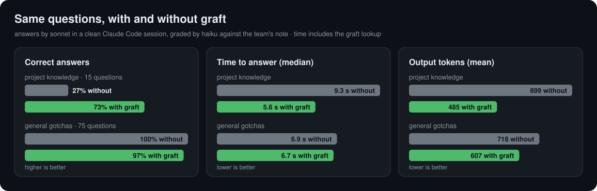
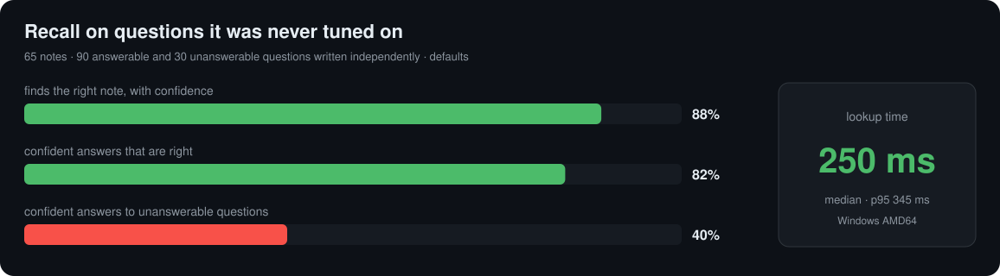

# Benchmark

Two reproducible benchmarks of what graft promises:

- **`run.py`** — recall quality and latency: does `graft query` answer with
  confidence only when it has the right note, and how fast.
- **`agent.py`** — what graft changes for an agent: the same questions answered
  with and without it, measured on correctness, time and tokens.

`charts.py` turns the newest results into the charts in the project README.
`fts_lexical.py` scores the BM25 lists of `retrieve` on their own, without a
daemon or a model ([why AND stays](./results/2026-10-05-fts-match/README.md)).

## Latest results

graft 0.1.1, Windows, built-in defaults, answers by Claude Sonnet in Claude Code.
Full numbers in [`results/`](./results/).



| Questions | n | right answers | made-up answers | tokens (mean) | time (median) |
| --------- | -: | -: | -: | -: | -: |
| about the team's own code | 15 | 27% → 73% | 27% → 0% | 899 → 485 | 9.3 s → 5.6 s |
| general coding gotchas | 75 | 100% → 97% | 0% → 1% | 718 → 607 | 6.9 s → 6.7 s |

On 30 questions that no note answers, an injected wrong note misled the answer
0 times. Every wrong answer with graft on project questions came from a lookup
that missed (2) or returned the wrong note (2), never from the agent ignoring a
right one.



The red bar is the open problem: questions on the same technology as a note but
about a different problem still get a confident answer too often. On the dev set,
which the thresholds were tuned on, the same numbers are 98%, 92% and 20%; the
gap is why the held-out set is the one quoted.

```bash
python bench/run.py                       # held-out set, the graft on PATH
python bench/run.py --set dev             # the author's set, optimistic
python bench/agent.py                     # needs the claude CLI, billed to that account
python bench/charts.py                    # writes assets/bench-*.svg
python bench/fts_lexical.py               # the lexical branch alone, no daemon
python bench/run.py --extend bench/corpus-ext   # plus 45 project notes and their questions
```

`run.py` and `agent.py` start their **own** `graftd` with a temporary
`GRAFT_HOME`, socket, database and usage log, and an installer-style config that
sets only the model path, so every other setting is the built-in default. Your
graph and your `usage.jsonl` are never touched. Python 3.10+, standard library
only, plus the BGE-M3 model (`--model`, default `$GRAFT_HOME/models/bge-m3.gguf`).
Pass `--graft build/graft` to measure a local build.

On Windows, a development build needs the llama.cpp and MinGW DLLs on `PATH`
first: `third_party/llama.cpp/build/bin` and `C:\msys64\mingw64\bin`.

## Corpus

| File | What it is |
| ---- | ---------- |
| [`nodes.jsonl`](./corpus/nodes.jsonl) | 50 general coding gotchas, one problem and its fix each (git, Docker, PostgreSQL, Python, Node, React, Kubernetes, CI…) |
| [`project_nodes.jsonl`](./corpus/project_nodes.jsonl) | 15 notes about a fictional company monorepo, "Orbit": conventions, decisions and local gotchas no model can know from training |
| [`heldout.jsonl`](./corpus/heldout.jsonl) | 120 questions written independently, by an agent that saw only the notes and never the dev set or the thresholds |
| [`queries.jsonl`](./corpus/queries.jsonl) | the dev set: 140 questions written by the author of the thresholds |

[`corpus-ext/`](./corpus-ext/) is an optional extension, loaded with `--extend`,
for what the base set covers thinly: team-specific knowledge. It adds 45 project
notes (20 more about Orbit, 25 about "Ledgerline", a fictional payments
platform whose vocabulary overlaps Orbit's) and, for each set, project
questions in English and Italian plus project-flavoured negatives. The
held-out file (120 questions) was written by an agent that saw only the notes;
the dev file by a different agent under the same rule, then stripped of the 34
questions too similar to a held-out one (word Jaccard > 0.5), leaving 86. The
two still share scenarios, since each note has only a few natural symptoms.
Extended runs are tagged `+corpus-ext` in the result file names, so they never
mix with the base numbers quoted above.

Query kinds:

| Kind | What it tests |
| ---- | ------------- |
| `exact` | The note title verbatim (dev set only, generated). Reported, never aggregated. |
| `paraphrase` | The symptom in a developer's own English words. |
| `crosslang` | The same, asked in Italian against an English note. |
| `project` | A team member's question about Orbit. |
| `negative` | No note answers it. Most are on the same technology as a note, which is the hard case. |

`expect` is the `key` of the note that answers the query, or `null`.

## `run.py` metrics

- **STRONG hit rate**: answerable questions answered `STRONG` with the right note.
- **STRONG precision**: share of `STRONG` answers that point at the right note.
- **False STRONG on negatives**: unanswerable questions that still got a `STRONG`.
- **recall@1 / recall@k / MRR** for `graft retrieve`.
- **Latency**: p50 / p95 of the CLI-to-daemon round trip, from the run's private
  usage log, plus the p50 including process start-up.

## `agent.py` method

Every held-out question is answered twice by the same model in a clean Claude
Code session (`claude -p --safe-mode`: no CLAUDE.md, hooks, plugins, skills, MCP
servers or tools):

- **without** — the question only;
- **with** — the question plus what `graft query` returned for it, injected the
  way the optional prompt hook does. Wrong hits are injected too, and the time
  includes the lookup, hit or miss.

A second model grades each answer against the note that really answers the
question: *correct*, *abstained* (did not commit) or *invented* (a confident
cause or fix that contradicts the note). For unanswerable questions it checks
whether an injected note derailed the answer. Reported: share of each verdict,
mean output tokens (thinking included), median time and cost.

Each run writes `results/<date>-<os>-<version>-<set>.json` (summary plus every
question with its signals or answers) and a `.md` table.

## Caveats

- 65 notes is a small graph. It measures the verifier's decisions and the effect
  on an agent, not behaviour at 10k notes.
- The held-out questions and the Orbit notes were written by a language model,
  independently of the thresholds, but not by real users.
- `agent.py` asks single questions with no tools. A real agent session that
  explores a repository usually spends more before it finds an answer, so the time
  and token savings here likely understate the effect; this is not measured.
- An LLM grader can be wrong; every verdict is in the JSON to check.
- Latency depends on the CPU and the embedding thread count. Compare runs from
  the same machine only.
